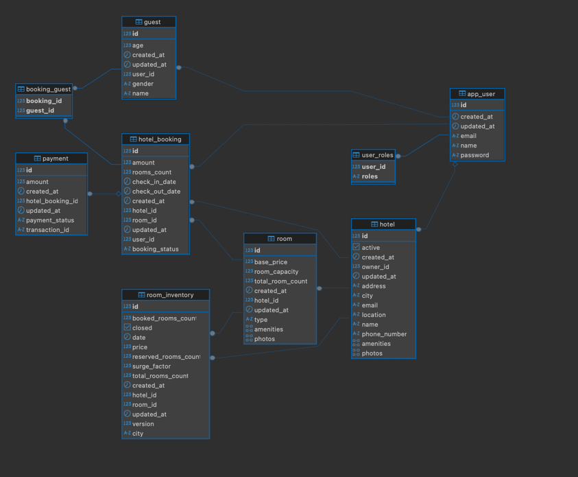

### 📘 **Project**

**Airbnb Hotel Booking System** — This project provides API implementations for managing hotels, rooms, bookings, user
creation, and guest management. The API is developed following clean code practices and SOLID principles.

* **Java Version**: 21
* **MySql Version**: 9.3.0 for macos15.2 on arm64 (Homebrew)

---

### ✅ **Requirements**

1. **Entity Definitions**

    * **Hotel**
        * Create hotel
        * Update hotel
        * Delete hotel
        * Activate hotel

2. **Database Design**

    * Design relational database schema covering all entity relationships with appropriate foreign keys and join
      tables (especially for many-to-many).

3. **REST API**

    * Implement CRUD operations for all entities.
    * Use **Spring MVC architecture** to structure the application.

---

### ✅ **Configuration**

Install Stripe Web hook CLI and run the command to start listed the payment staus:

`stripe listen --forward-to localhost:8080/api/v1/webhook/payment`

### ✅ **Database Diagram**

### **Reference links**

- https://stackoverflow.com/questions/66662013/stripe-login-zsh-command-not-found-stripe (Stripe CLI installation fix)
